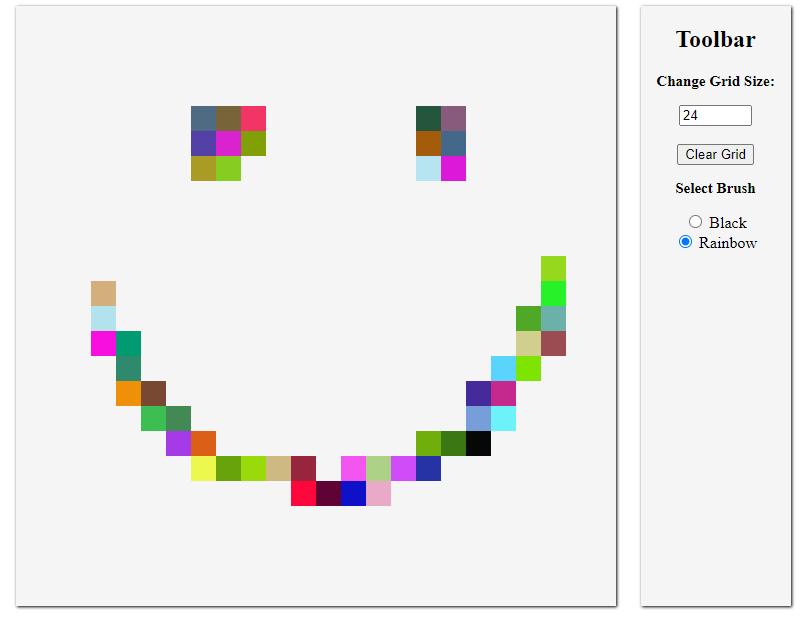

# ✏️ Etch-A-Sketch


## 📖 About

This is a simple but fun "Etch-A-Sketch" demo built on top of the browsers DOM.

<details>
  <summary>📸 Screen Shots</summary>



</details>

---

#### 🌟 Current Features:

- Ability to draw on a grid right in the browser.
- Ability to select from two brush colors (black and rainbow).
- Ability to customize the grid size up to a limit of 100 x 100 grid size.
- Ability to clear the erase or clear the current drawing to start over.

#### 📋 Planned Features:

_No new features are currently planned for this project. Feel free to contribute your own ideas and submit a pull request_

---

&nbsp;<br>

## 🛠️ Built With

### 📝 Languages

- **HTML**: Used for structuring the content on the web page.
- **JavaScript**: Adds interactivity and handles grid layout via DOM manipulation.
- **CSS**: Styles the web page for a better user experience.

### 📚 Libraries and Frameworks

_No frameworks were used for this project._

### 🌐 APIs and Services

- **DOM API**: Employed for client-side manipulation of the document structure.

### 📦 Package Managers

- **NPM**: Handles dependency management and scripts.

### 🛠️ Development Tools

- **Live Server**: Used for setting up a local development server for real-time website updates.

&nbsp;<br>

## 💻 Installation / Setup

1. Clone this repo to your machine:

```
git clone https://github.com/xBromsson/dnd-spells.git
```

2. Install dependencies

```
npm install
```

3. Start the live server to test it out!

```
npm start
```

&nbsp;<br>

## 📜 License

This project is released into the public domain using The Unlicense - see the [LICENSE](https://choosealicense.com/licenses/unlicense/) file for details.

&nbsp;<br>

## 🤝 Contributing

We welcome contributions to this project! Here's how you can help:

1. **Fork the Repository**: Create a fork of this project to your GitHub account.

2. **Clone the Fork**: Clone the fork to your local machine.

   ```
   git clone https://github.com/your-username/project-name.git
   ```

3. **Create a Branch**: Create a new branch to work on.

   ```
   git checkout -b my-new-feature
   ```

4. **Make Changes**: Make your changes or additions to the new branch.

5. **Commit and Push**: Commit your changes to your own branch and push the work back up to your fork.

   ```
   git push origin my-new-feature
   ```

6. **Pull Request**: Open a pull request to propose your changes to the `main` branch.

For more information on using GitHub, please refer to GitHub's [How To](https://docs.github.com/en/github/collaborating-with-issues-and-pull-requests).

Thank you for your contributions!
